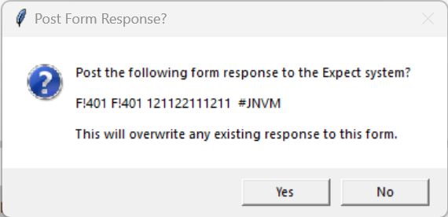
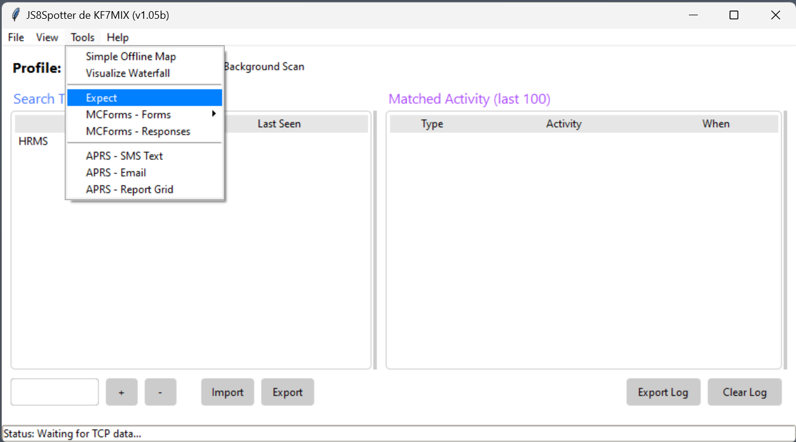
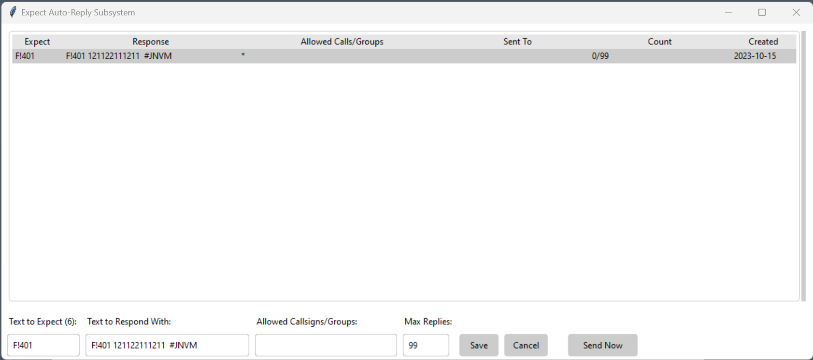
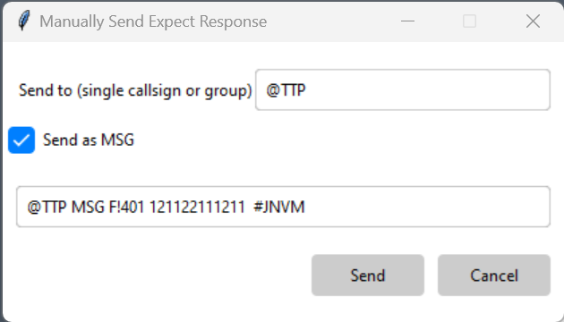

# TTP MCForms

[Introduction to MCForms](../assets/howto/mcforms.md)
<!-- TO DO: add more details about me later -->

Quick Start Guide

### Quick Start

Download [JS8Spotter](https://kf7mix.com/js8spotter.html) and install/setup as instructed.
Note that you will need to make sure your instance of JS8Spotter has the correct port settings and JS8Call must be set up
to receive connections from the software.
View the [Introduction to JS8Spotter Video](https://www.youtube.com/watch?v=eE8PhzN8IZY)
to learn about basic functionality.

- Place .txt files in the `forms` directory where you installed JS8 Spotter.
- Verify JS8 Spotter has imported the forms by clicking on `Tools > MCForms - Forms`. You should see the imported forms in the menu. If not, close JS8 Spotter and try again.

### Filling the forms.

- Start JS8 Spotter, click on `Tools > MCForms - Forms` and select the form you want to use. 
- Select pre-populated answers from the dropdown list.

Once the form has been completed:
- Click `Post Form to Expect`. A popup will appear to confirm your post.
- Click `Yes` to submit.

  

### Submitting the Forms

- Click on `Tools > Expect`

The expect system window will open.
- Right-click on your form to load the response.
- Click `Send Now`

The _Manually Send Expect Response_ window will open.
- Enter call sign or group
- Ensure the `Send as MSG` box is checked
- Click `Send`

  

# Form Specific Instructions

MC400 TTP Routine Checklist

### MC400 TTP Routine Checklist

MC401 TTP MEDEVAC Checklist

### MC401 TTP MEDEVAC Checklist

