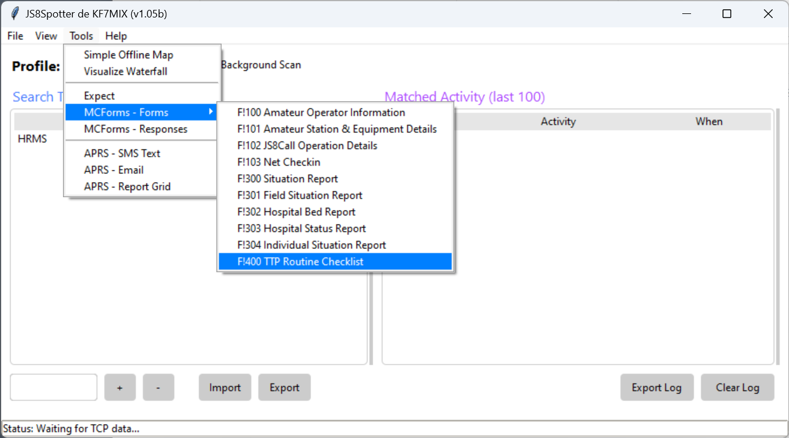
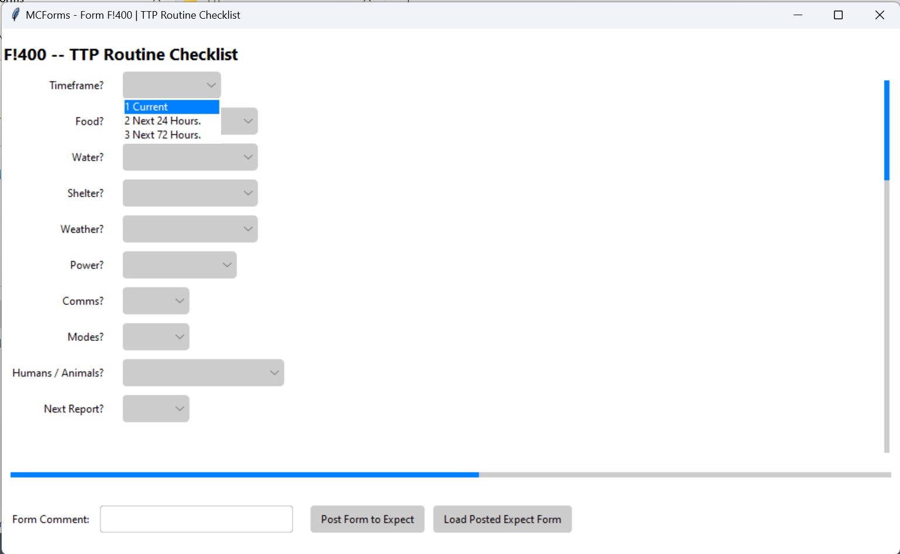

# TTP MC Forms

These forms are for use with [JS8 Spotter](https://kf7mix.com/js8spotter.html)

- Place .txt files in the _forms_ directory where you installed JS8 Spotter.
- Verify JS8 Spotter can has imported the forms by clicking on Tools > MCForms - Forms. You should see the imported forms in the menu. If not, close JS8 Spotter and try again.

To use the forms.

- Start JS8 Spotter, click on Tools > MCForms - Forms and select the form you want to use. 
- Select pre-populated answers from the dropdown list. 

[Introduction to MCForms](../assets/howto/mcforms.md) - WORK IN PROGRESS

# Form Specific Instructions

## MC400 TTP Routine Checklist

## MC401 TTP MEDEVAC Checklist