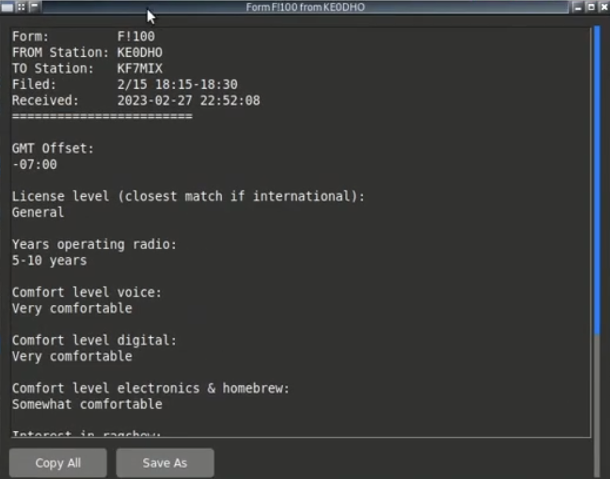
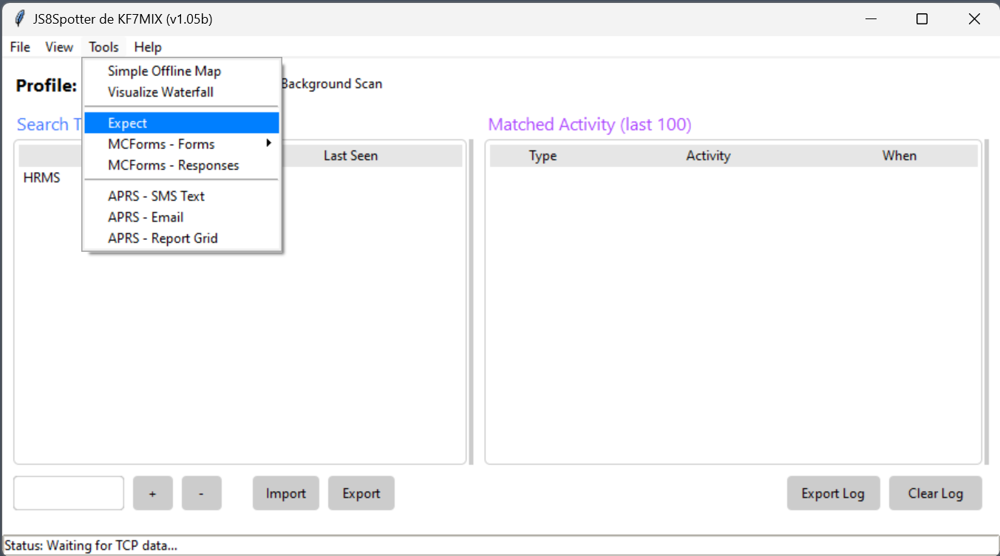

# Introduction to MCForms

## What are MCForms
Basically it is a Multiple Choice Form (MCForms). The form collects the
assigned value to answer options provided. The form populates an alpha or numerical value into the message for transmittal.
With MCForms, a message would consist of values such as "13241ABC" which map to the answers selected in the form dropdown menu.
This allows for uniformity of messages and drastically reduces the amount of resources necessary to transmit. 
If a preselected answer does not exist, those fields contain an [Expect Statement](#expect-subsystem).

**ELI5**: If a form contains the question "What is the weather", dropdown options may be something like: 

- 1 sunny 
- 2 rain 
- 3 hurricane

Selecting rain would only require transmitting the number "2" as opposed to the word "rain."

## Where do I put them?
The text files beginning with MCF should be placed in the `forms` directory where js8spotter was installed.
On windows that would typically be `C:\js8spotter-<version number>\forms` however may be different on your computer.

## How do I use them?
### Transmitting a form
In JS8Spotter, click `Tools > MCForms - Forms` then click on the form you intend to use. All TTP forms are formatted as `F!4XX TTP <FORM NAME>`

### Reading a form
To read a form:
- Click on `Tools > MCForms - Responses`

In the window, you will see a list of the forms your station has received.

  

- Double-click on the message you want to view. A window will open with the full message.

The top 5 lines in the form contain:
- **Form:** The form ID.
- **FROM Station:** Station sending the form
- **TO Station:**Intended recipient station (or group) 
- **Filed:** Date and time the form was filed. Filed is when the operator posted the form. This is __not__ when the form was transmitted.
- **Received:** Date and time your station received the form. 

**NOTE:** If you do not have the associated form, or correct version in JS8Spotter,
you will only see numbers or letters instead of questions and answers.
It is a good practice to obtain the current files prior to the weekly net.

## Expect Subsystem

### Overview
The Expect Subsystem provides a method of expanding JS8Call's user-configurable auto-response ability.
TTP uses the Expect Subsystem to augment MCForms. 
As explained above,
we use MCForms for uniformity of messages
and drastically reduce the amount of resources necessary to transmit messages.
Some questions may require additional information which a prepopulated response would not be appropriate. 

### Using the Expect Subsystem
Instructions for specific forms are located [here](../../MCForms/README.md). 

#### Setting a response
As an example, we will be providing our maidenhead as an answer to `TTP MEDEVAC Checklist` (MCF401).
The 1st question requests "Location of Pickup Site" of which there are two options.
or `Retrieve location (maidenhead grid, coords, etc.) with "E? F!401A"`

- Click on `Tools > Expect`
  
- Choose `F!401 TTP MEDEVAC Checklist`
  
- Click on the dropdown of the 1st question `Retrieve location (maidenhead grid, coords, etc.) with "E? F!401A"`.

Note the last part of the question `"E? F!401A"`.
"F!401A" is what you will enter in "Text to Expect."

Once the form has been posted:
- Click on `Tools > Expect`
  
- In the new window, you will be populating the following mandatory fields:
  - **Text to Expect** - This is the value indicated on the question. In this case `F!401A`
  - **Text to Respond With** - This is the response to the question. In this case `DN55PT` is the maidenhead location
  - **Allowed Callsigns/Groups** - The group or call sign allowed to query. In this case `*` for any station
  - **Max Replies** - Number of times your station will reply to this query. In this case, your station will automatically answer a maximum of five queries. 

Expect fields are identified by `F![Form Number][Question Identifier]`.

Questions are identified alphabetically, in this case the 1st question would be A. Question 5 would be E and so on.
Note that if questions 2-4 do not use the Expect Subsystem,
the alphabetical order remains consistent based on the question number.
Therefore, question 5 would be E, not B.  